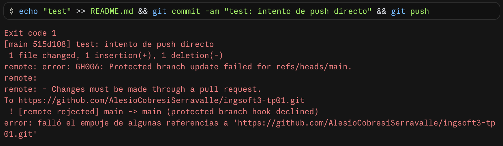
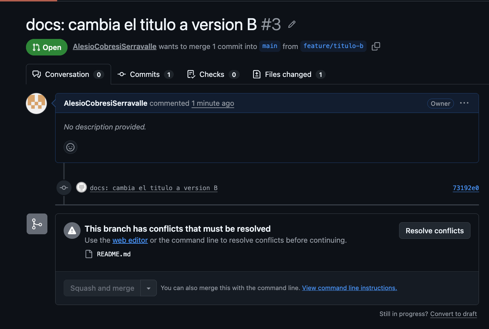
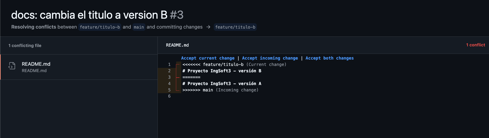
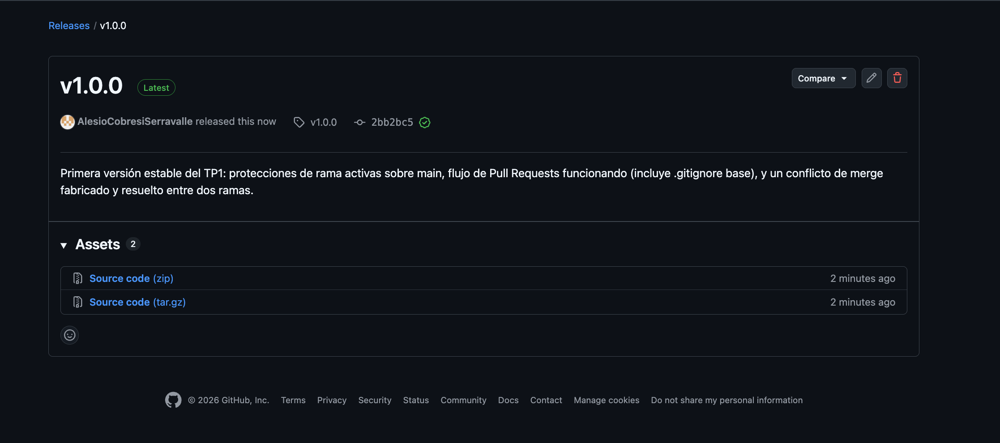

# Evidencias — TP1

## 1. Push directo a `main` rechazado



Intento de `git push` con un commit hecho directo sobre `main`. GitHub lo rechaza con
`GH006: Protected branch update failed` porque la rama está protegida y la regla exige que todo
cambio entre por Pull Request — la protección alcanza también al dueño del repositorio.

## 2. El PR de la rama B no se puede mergear: conflicto



Las ramas `feature/titulo-a` y `feature/titulo-b` nacieron del mismo commit de `main` y modificaron
la misma línea del `README.md`. Tras mergear el PR de la rama A, GitHub avisa en el PR de la rama B
que "This branch has conflicts that must be resolved": no puede combinar automáticamente los dos
cambios porque tocan exactamente el mismo lugar del archivo.

## 3. Los marcadores del conflicto



Vista del editor de resolución de conflictos de GitHub sobre `README.md`. Se ven los tres
marcadores: `<<<<<<< feature/titulo-b` (mi rama, "current change"), `=======` (separador) y
`>>>>>>> main` (lo que ya está en `main`, "incoming change" — la versión A, mergeada primero).

## 4. La release publicada



Release `v1.0.0`, marcada como *Latest*, publicada sobre el commit `2bb2bc5` con notas de qué
incluye esta versión.

# Evidencias — TP2

## 1. Sistema completo arriba con un solo comando

```
$ docker compose up -d --build
 backend  Built
 frontend  Built
 migrate  Built
 Network ingsoft3-tp01_default  Created
 Volume "ingsoft3-tp01_db_data"  Created
 Container ingsoft3-tp01-db-1  Started
 Container ingsoft3-tp01-db-1  Healthy
 Container ingsoft3-tp01-migrate-1  Started
 Container ingsoft3-tp01-migrate-1  Exited
 Container ingsoft3-tp01-backend-1  Started
 Container ingsoft3-tp01-frontend-1  Started

$ docker compose ps
NAME                       SERVICE    STATUS
ingsoft3-tp01-backend-1    backend    Up
ingsoft3-tp01-db-1         db         Up (healthy)
ingsoft3-tp01-frontend-1   frontend   Up

$ curl http://localhost:8080/api/dashboard/resumen
{"totalEquipos":0,"disponibles":0,"prestados":0,"vencidos":0,"proximosAVencer":0}
```

El orden de arranque (`db` sana → `migrate` corre y termina → `backend`/`frontend`) se ve en el log
completo, y el sistema responde de punta a punta a través del puerto publicado del frontend.

## 2. Prueba de persistencia

```
$ curl http://localhost:8080/api/equipos
[{"nombre":"Kit Arduino UNO", "codigo":"ARD-001", ...}]

$ docker compose down          # apaga, NO borra el volumen
$ docker compose up -d
$ curl http://localhost:3000/api/equipos
[{"nombre":"Kit Arduino UNO", "codigo":"ARD-001", ...}]   # <- sigue ahí

$ docker compose down -v       # apaga Y borra el volumen
$ docker compose up -d
$ curl http://localhost:3000/api/equipos
[]                                                        # <- vacío
```

`down` conserva los datos (el volumen `db_data` sigue existiendo); `down -v` los borra y el sistema
vuelve a nacer vacío, con `migrate` recreando el schema desde cero sobre el volumen nuevo.

## 3. Comparación de tamaño: imagen de build vs. imagen final (backend)

```
$ docker images
campusgear-backend   build-stage   631MB     # con prisma, typescript y el resto de las devDependencies
campusgear-backend   dev           298MB     # solo dependencias de producción
```

Más del doble de reducción, lograda excluyendo devDependencies (`--omit=dev`) y la peer dependency
opcional `prisma` (`--omit=peer --omit=optional`) de la imagen que corre en producción — el detalle
completo del diagnóstico está en `decisiones.md`.

## 4. Imágenes públicas en el registry

```
$ docker logout ghcr.io
Removing login credentials for ghcr.io

$ docker pull ghcr.io/alesiocobresiserravalle/campusgear-backend:v0.1.0
v0.1.0: Pulling from alesiocobresiserravalle/campusgear-backend
Status: Downloaded newer image for ghcr.io/alesiocobresiserravalle/campusgear-backend:v0.1.0

$ docker pull ghcr.io/alesiocobresiserravalle/campusgear-frontend:v0.1.0
v0.1.0: Pulling from alesiocobresiserravalle/campusgear-frontend
Status: Downloaded newer image for ghcr.io/alesiocobresiserravalle/campusgear-frontend:v0.1.0
```

Las dos imágenes se descargan **sin estar logueado** — la prueba real de que son públicas (no que la
página lo diga). Con eso, `docker-compose.registry.yml` levanta backend y frontend descargándolos en
vez de construirlos:

```
$ docker compose -f docker-compose.registry.yml up -d --build
 frontend Pulled
 backend Pulled
 migrate Built     # este sigue construyendo desde el código, ver decisiones.md
```
